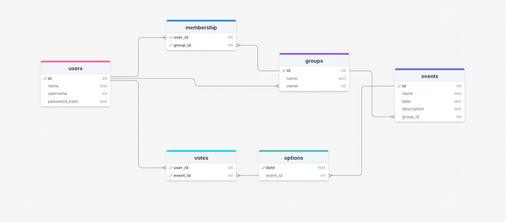
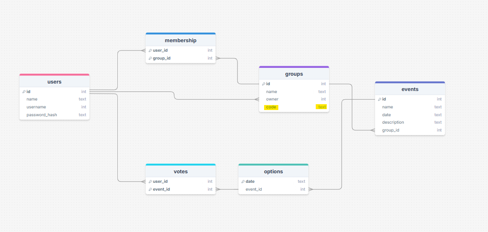
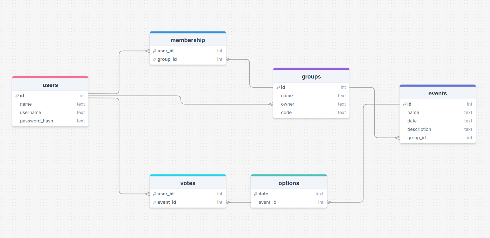
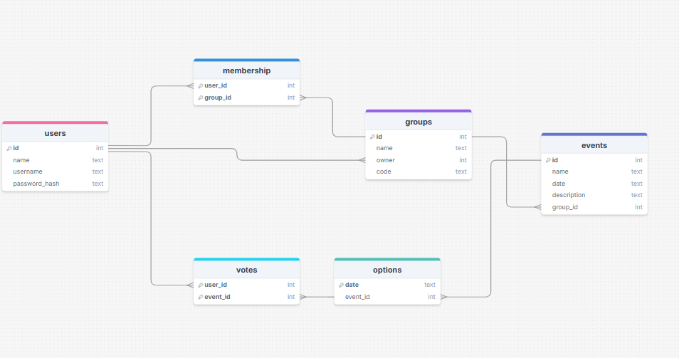
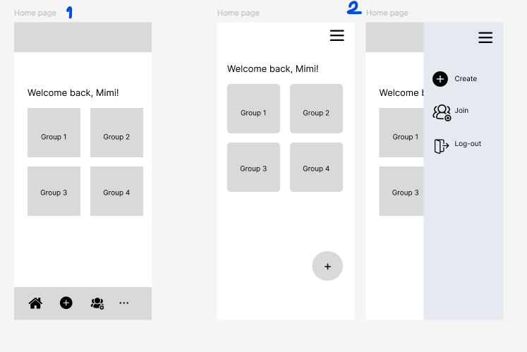
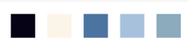

# Sprint 1 - A Working UI Prototype

## Sprint Goals

Develop a prototype that simulates the key functionality of the system, then test and refine it so that it can serve as the model for the next phase of development in Sprint 2.

[Figma](https://www.figma.com/) is used to develop the prototype.

---

## Initial Database Design

This initial database design contains 5 tables: users, membership, votes, groups, events, and options. These tables are linked together either by 1:N or N:N relatioship, and work together to allow information about users, groups, and events to be stored in the database and allow some actions to happen.

### Required Data Input

Admin users will provide:
- Information about the group (via create group form)
- Information about events (via add event form)

Normal users will provide:
- Basic personal information of the international student leaders (name, username, password) (via sign-up form)

### Required Data Output

Admin users will see:
- Name/profile of the user
- List of groups (that they are part of or have created)
- List of events associate to that group, with details/description and date shown.
- Results from the poll-vote and usernames of normal users

Normal users will see:
- List of groups (that they are part of)
- List of events assocaite to each group, with details/description and date shown.
- Results from the poll-vote and usernames of normal users.

Note that the data output for both types of users are very similar. However, admin users are capable to do more actions than normal users (some buttons or functionality will only appear for admin users).

### Required Data Processing

Users can only access the website only if they can log-in. So, username and password input via log-in form must be compared to what is stored in users table of the database.

List of groups will be displayed differently for each user, as they are part of different group. So, a query is required to run through the membership table and match the user id with the group id.

For the list of events for each group, the database must sorted only events with the "group_id" of the events table that match the "id" of the groups table.

## Database design improvement

After talking to my end-users (other international students leaders), they prefer entering a code to join a group, rather than admin inviting people into the group when he/she create a group.

A new field "code" has been added to the group table of the database. This is to store the unique code generated for each group and make sure that they do not match.

The data type for username (users table) and owner (groups table) are wrong, They both should be text and not integer.

The data type for the owner (groups table) is wrong. It should match the data type of the id of the users table as it acts as the foreign key, so I have to update my database.

---

## Initial UI prototype

The first stage of prototyping was to explore how the UI might 'flow' between states, based on the required functionality.

This Figma demo shows the initial design for the UI 'flow':

<iframe style="border: 1px solid rgba(0, 0, 0, 0.1);" width="400" height="600" src="https://embed.figma.com/proto/rQzjfoJis2WS7K63ukgTPP/website-v1?node-id=4-2&p=f&scaling=scale-down&content-scaling=fixed&page-id=0%3A1&starting-point-node-id=4%3A2&embed-host=share" allowfullscreen></iframe>

### Testing

I used the flow myself to make sure that the website has no dead-end and let my end-user used it as well.

### Changes 1

My end-user were ok with the UI flow. However, I gave them 2 options of ways that they can join the group. 
1. Let the admin (person who creates the group) invites the members by using a drop down menu with a list of people on the form (this is also my initial thought and what my first prototype was based on).
2. Let the system generates a unique code for the group to the admin, and the admin can pass that on to other people to enter and join the group (I recall that some of the websites use this method, so I put it out as an alternative option).

It turned out that my end-users like the second method better. They think it is easier to do so rather than inviting all the people, and it would mean anyone can join at anytime if they have the code.

This means that I will need another buttons and page to allow user to enter that code, and a flow that links them back to the group page but with that group that they have just joined display too.

One of the leader also pointed out that the log-out button should not be there, as it can be very easy for her to hit it accidently and therefore means she has to log-in again.

To sum up, I need to:
1. Create a page and buttons for users to join a group.
2. Place the log-out button somewhere else and come up with a navigation bar layout.

### Changes 2
I came out with 2 different options for the position of navigation bar:
1. Place all the buttons at the bottom, and sensitive buttons like log-out is hidden with in the 3 dots button.
2. The action buttons are all hidden in the menu icon, which means if the users want to access any tools, they must tap the menu icon on the top right of the page.

I asked my end-users to choose which one they like better. They all prefer the second one, with a reason that it is much more neat and clear.

<iframe style="border: 1px solid rgba(0, 0, 0, 0.1);" width="400" height="700" src="https://embed.figma.com/proto/kbbRc4nmNYt9AFNVTR4UA7/navigation-bar-final?node-id=1-2&p=f&scaling=min-zoom&content-scaling=fixed&page-id=0%3A1&starting-point-node-id=1%3A2&embed-host=share" allowfullscreen></iframe>

After this, I went on to add the join group page and fixed the flow.

<iframe style="border: 1px solid rgba(0, 0, 0, 0.1);" width="400" height="700" src="https://embed.figma.com/proto/lniGx1Cf6cHL2mNWW8Al6X/website-v6?node-id=6-104&p=f&scaling=scale-down&content-scaling=fixed&page-id=0%3A1&starting-point-node-id=4%3A2&embed-host=share" allowfullscreen></iframe>

Tools available on each page are different, and it also depends on whether you are an admin/owner of the group or not

## Changes 3
The color scheme that the end-user prefer is blue, so I gave my end user these 2 options of color palette;

These 2 are very different and in fact, the second lean towards green rather than blue, but I thought it looked quite nice and so put it out there for the end user. 

---

## Refined UI Prototype

This is with the first color palette:

<iframe style="border: 1px solid rgba(0, 0, 0, 0.1);" width="800" height="450" src="https://embed.figma.com/proto/uGCsdR37WTSxrzPNeulhOo/website-v6--Copy-?node-id=4-5&p=f&scaling=scale-down&content-scaling=fixed&page-id=0%3A1&starting-point-node-id=4%3A2&embed-host=share" allowfullscreen></iframe>

This is with the second color palette:

<iframe style="border: 1px solid rgba(0, 0, 0, 0.1);" width="800" height="450" src="https://embed.figma.com/proto/i97iqXxuwIXiCHv6Vqffl7/website-v6--Copy---Copy-?node-id=6-104&scaling=scale-down&content-scaling=fixed&page-id=0%3A1&starting-point-node-id=4%3A2&embed-host=share" allowfullscreen></iframe>

---

## Sprint Review
The sprint helped me plan my website, whether both for the functionality and appearance of it. I was also able to record some feedback from my end-user at this point, so I would be able to keep in mind about those feedback while creating the website.

I was able to invent the key features of this website and think about how the layout of this website will look like.

