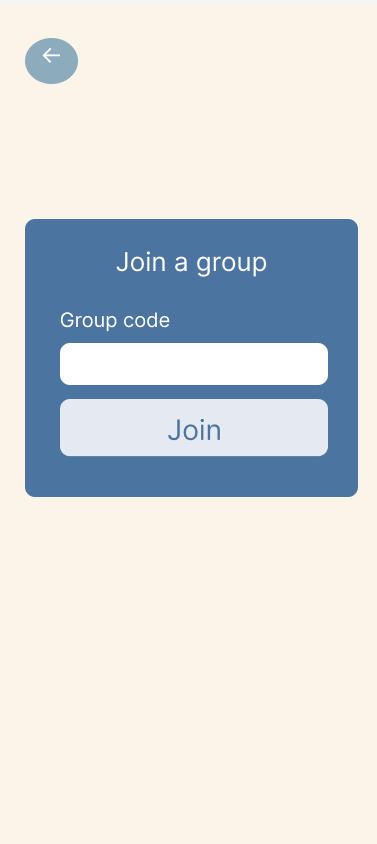
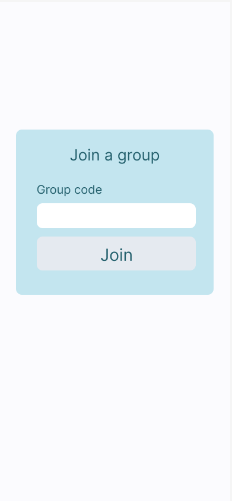
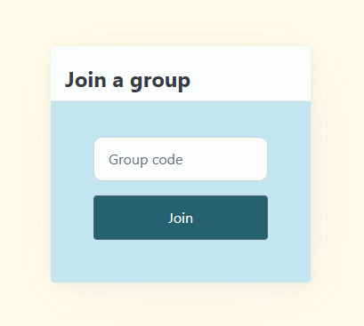
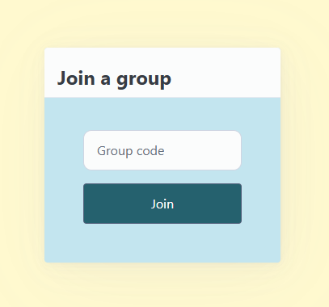

# Sprint 2 - A Minimum Viable Product (MVP)

## Sprint Goals

Develop a bare-bones, working web application that provides the key functionality of the system, then test and refine it so that it can serve as the basis for the final phase of development in Sprint 3.

---

## Implemented Database Schema

Replace this text with notes regarding the DB schema.

Options 1-5 colums are added to the events table. This gives options for the user to vote , and limit the maximum options at 5. This also allow the owner of the group to input choices they want to answer the question (e.g. options for where and when would be different).

Options columns are added to the votes table. This will count and show the number of that votes.

---

## Initial Implementation (the whole thing)

The key functionality of the web app was implemented:

**PLACE SCREENSHOTS AND/OR ANIMATED GIFS OF THE SYSTEM HERE**

---

## Login

User should be able to login to their account. I need to test:
- The user can login (compare their username and password hash to that of the database), which then takes them to the home page of the website/app.
- If the username or password is invalid, the user will not be able to log in.
This can be tested by implementing a random username and password manually through the database, and try logging in with these information using the login form.
Replace this text with notes about what you are testing, how you tested it, and the outcome of the testing

**PLACE SCREENSHOTS AND/OR ANIMATED GIFS OF THE TESTING HERE**

### Changes / Improvements

Replace this text with notes any improvements you made as a result of the testing.

**PLACE SCREENSHOTS AND/OR ANIMATED GIFS OF THE IMPROVED SYSTEM HERE**

---

## Log out

User can log out of their account (so others can login or to keep the privacy). The test can be done by clicking the log out button, and this should take the user back to the log in page.

**PLACE SCREENSHOTS AND/OR ANIMATED GIFS OF THE TESTING HERE**

It seem that the log out button works. However, the user can use the browser's back button to return to the login page too and the website appears to be loading for logging in forever. This doesn't follow the functionality heuristic.

### Changes / Improvements

Replace this text with notes any improvements you made as a result of the testing.

**PLACE SCREENSHOTS AND/OR ANIMATED GIFS OF THE IMPROVED SYSTEM HERE**

---

## Sign up

The user is able to sign up if they have not yet done that. The sign up button should take the user to the sign up form page. To test this, I can try sign up and login with those credentials. I should be able to login after signing up as my data has been stored in the database.

Replace this text with notes about what you are testing, how you tested it, and the outcome of the testing

**PLACE SCREENSHOTS AND/OR ANIMATED GIFS OF THE TESTING HERE**

### Changes / Improvements

Replace this text with notes any improvements you made as a result of the testing.

**PLACE SCREENSHOTS AND/OR ANIMATED GIFS OF THE IMPROVED SYSTEM HERE**

---

## Create group

Any user can create a group. Each group has got a unique code that can shared to other people to join the group. I will test this by creating the group myself. The expected outcome is that the gorup added is shown on the group page, and a unique code has been generated. 

Once the 'add" button is hit, user is taken back to the home page and the "New Group 8" can be display on the screen. However, I think i have chosen it to appear as ascending order, but it this is not convenient because if there are many groups, the user has to scroll to find the new group that has been added. It should be the first group on the very top after it has been added.

The unique code should also be placed somewhere for the owner to see only.

### Changes / Improvements
This is when ordering the groups added have been fixed.
The "New Group 9" is shown on the top of the group list.

**PLACE SCREENSHOTS AND/OR ANIMATED GIFS OF THE IMPROVED SYSTEM HERE**

---

## Events page

This page shows all the events added to that group. To test this, I add some events into different groups via database. I am expecting to see only events associated to that group (e.g. when I click group 1 button, I should only see events that are added to group 1).

**PLACE SCREENSHOTS AND/OR ANIMATED GIFS OF THE TESTING HERE**

### Changes / Improvements

Replace this text with notes any improvements you made as a result of the testing.

**PLACE SCREENSHOTS AND/OR ANIMATED GIFS OF THE IMPROVED SYSTEM HERE**

---

## Create event page

This page shows all the events added to that group. To test this, I add some events into different groups via database. I am expecting to see only events associated to that group (e.g. when I click group 1 button, I should only see events that are added to group 1).

Whilw trying to created an event, I have noticed that the question box appeared as null. This should not be the case since the owner might want to provide the information only.

 This shows that the new event, "Math help" appear in the "Math help" group. Images below shows that the new event has been added to the database:
 
 

 One thing that has to be fixed is that once the new event has been added, the user should be taken back to the event page, not the home page (this tells them immediately that the new event has been added). Mr. Copley complained about the inconsistency of the menu, so this has to be fixed real soon.

### Changes / Improvements

Replace this text with notes any improvements you made as a result of the testing.

**PLACE SCREENSHOTS AND/OR ANIMATED GIFS OF THE IMPROVED SYSTEM HERE**

---

## Join group

The user can join groups by inputting a unique code. To test this, I will input the unique code generated when the group is created. If the code I input matches what is sored in the database, then I should see that group popped up on my home page. I fit does not match, there should be a flash message informing me thaat what I have input is wrong.

**PLACE SCREENSHOTS AND/OR ANIMATED GIFS OF THE TESTING HERE**

### Changes / Improvements

Replace this text with notes any improvements you made as a result of the testing.

**PLACE SCREENSHOTS AND/OR ANIMATED GIFS OF THE IMPROVED SYSTEM HERE**

---

## Delete group

Users are allowed to delete the group.

These are the data in my database tables before deleting a group.
I am testing the functionality of my delete function by deleting "TEST 2"

Here is what my table look like after the group TEST 2 has been deleted.

It makes sense that if the group is deleted, then the events in that group are also removed from the database, and is the same with the membership table. So fixed this manually with more sql commands.

Here is what it looks like aftef commands have been added.
Membership table before:

Events table before::

After deleting another group "TEST" (where group_id = 1):
Membership table after:

Events table after:

At the moment, anyone can delete the group but it would be more efficient if only the owner of the group can delete the group.

### Changes / Improvements

Replace this text with notes any improvements you made as a result of the testing.

**PLACE SCREENSHOTS AND/OR ANIMATED GIFS OF THE IMPROVED SYSTEM HERE**

---

## Sprint Review

Replace this text with a statement about how the sprint has moved the project forward - key success point, any things that didn't go so well, etc.

