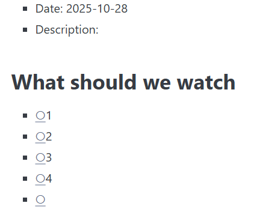

# Sprint 2 - A Minimum Viable Product (MVP)

## Sprint Goals

Develop a bare-bones, working web application that provides the key functionality of the system, then test and refine it so that it can serve as the basis for the final phase of development in Sprint 3.

---

## Implemented Database Schema

Replace this text with notes regarding the DB schema.

Options 1-5 colums are added to the events table. This gives options for the user to vote , and limit the maximum options at 5. This also allow the owner of the group to input choices they want to answer the question (e.g. options for where and when would be different).

Options columns are added to the votes table. This will count and show the number of that votes.

---

## Initial Implementation (the whole thing)

The key functionality of the web app was implemented:

**PLACE SCREENSHOTS AND/OR ANIMATED GIFS OF THE SYSTEM HERE**

---

## Login

User should be able to login to their account. I need to test:
- The user can login (compare their username and password hash to that of the database), which then takes them to the home page of the website/app.
- If the username or password is invalid, the user will not be able to log in.
This can be tested by implementing a random username and password manually through the database, and try logging in with these information using the login form.

This is when the login is successful:

This is when the login is unsucessful(invalid credentials):

---

## Log out

User can log out of their account (so others can login or to keep the privacy). The test can be done by clicking the log out button, and this should take the user back to the log in page.

[Logout](screenshots/logout.gif)

---

## Sign up

The user is able to sign up if they have not yet done that. The sign up button should take the user to the sign up form page. To test this, I can try sign up and login with those credentials. I should be able to login after signing up as my data has been stored in the database.

Note that this sign-up button needs styling that goes along with the login form.

---

## Homepage (group page)

The user is able to see groups that they are part of here. Also, only the user that is the owner of the group can delete the group.

Here I can see the code for each group. However, i am not the owner of the "Cookie taster" group, so I should not be able to see the group code. This means I have to add some conditions to my template.

I can no longer see cookie taster's group code, so this problem has been fixed. At the moment, the codes are very hard to see, so I should style them to make them neat and visible for the user.

---

## Create group

Any user can create a group. Each group has got a unique code that can shared to other people to join the group. I will test this by creating the group myself. The expected outcome is that the gorup added is shown on the group page, and a unique code has been generated. 

Once the 'add" button is hit, user is taken back to the home page and the "New Group 8" can be display on the screen. However, I think i have chosen it to appear as ascending order, but it this is not convenient because if there are many groups, the user has to scroll to find the new group that has been added. It should be the first group on the very top after it has been added.

This is when ordering the groups added have been fixed.
The "New Group 9" is shown on the top of the group list.

---

## Events page

This page shows all the events added to that group. To test this, I add some events into different groups via database. I am expecting to see only events associated to that group (e.g. when I click group 1 button, I should only see events that are added to group 1).

Events are displayed. However, I don't know whether the user wants to sort this by date or maybe by the most recent event added. So I have added some filtering buttons to the page.

"Soon" means is if the user wants to sort the event list by date
"Recent" means is if the user wants to sort the event list by the latest event added (i.e. by id). Note that these names are for testing and will be changed later.

When the soon button is hit, the events are sorted by events that are happening first. When the recent button is hit, the most recent that has been added is placed on top of the list (i.e. events are ordered by descending id).

There should be a "clear" button to clear the filters as well.

.
Once this button is clicked, any filter that was applied are cleared.
Note that the line printed is for when I tested the functionality of create event.

---

## Event details page

Options are listed, but there shouldn't be any button if there is nothing for that option.

---

## Create event page

This page shows all the events added to that group. To test this, I add some events into different groups via database. I am expecting to see only events associated to that group (e.g. when I click group 1 button, I should only see events that are added to group 1).

While trying to created an event, I have noticed that the question box appeared as null. This should not be the case since the owner might want to provide the information only.

 This shows that the new event, "Math help" appear in the "Math help" group. Images below shows that the new event has been added to the database:
 
 
 

 One thing that has to be fixed is that once the new event has been added, the user should be taken back to the event page, not the home page (this tells them immediately that the new event has been added). Mr. Copley complained about the inconsistency of the menu, so this has to be fixed real soon.

 The main header, which is the name of the app, is used as back button instead. This always takes the user back to the homepage once clicked.

 ![Previous page]screenshots/(screenshots/back_home.gif)

 The header and menu of the app are now consistent on every page.

 This fixed how the user was not taken back to the event page. However, the new event added wa in the middle of the events list. This makes it harder to see whether the event has been added or not, so I need to make sure that the new event added appear at the top.

  
 This needs to be fixed, because we only want the owner to be able to add new event to the group

 

---

## Join group

The user can join groups by inputting a unique code. To test this, I will input the unique code generated when the group is created. If the code I input matches what is sored in the database, then I should see that group popped up on my home page. I fit does not match, there should be a flash message informing me that what I have input is wrong.

This is the database before joining the group

Now, I have join another group called "teams", which has a group id 3

This user has been added to the membership table. On the website, we can also see that this user cannot see the delete button, since the user is not the owner of the group

---

## Delete group

Users are allowed to delete the group.

These are the data in my database tables before deleting a group.
I am testing the functionality of my delete function by deleting "TEST 2"

Here is what my table look like after the group TEST 2 has been deleted.

It makes sense that if the group is deleted, then the events in that group are also removed from the database, and is the same with the membership table. So fixed this manually with more sql commands.

Here is what it looks like after commands have been added.
Membership table before:

Event table before::

After deleting another group "TEST" (where group_id = 1):
Membership table after:

Events table after:

At the moment, anyone can delete the group but it would be more efficient if only the owner of the group can delete the group.

---

## Sprint Review

Replace this text with a statement about how the sprint has moved the project forward - key success point, any things that didn't go so well, etc.

