# Sprint 3 - A Refined and Complete System

## Sprint Goals

Develop the system until it is fully featured, with a refined UI and it satisfies the requirements. The system will be fully tested at this point.

---

## Final Implementation
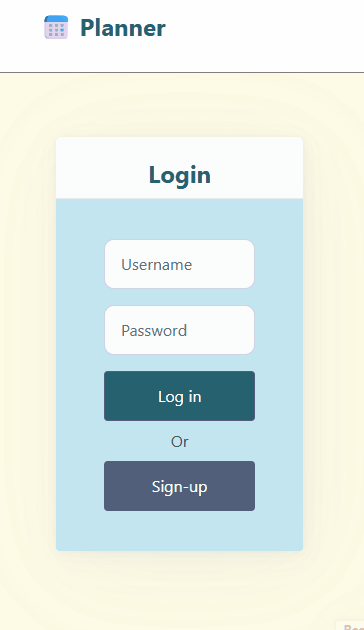

---

## Login and signup buttons layout

I have given my end-user 3 options to choose from for how login and signup buttons on the login page should look.
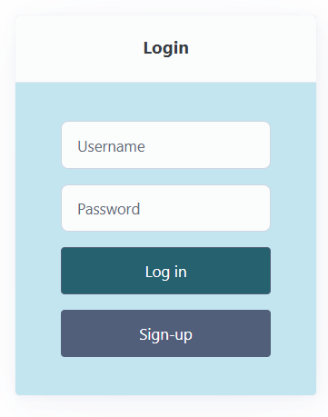
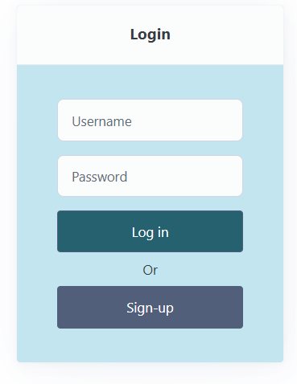
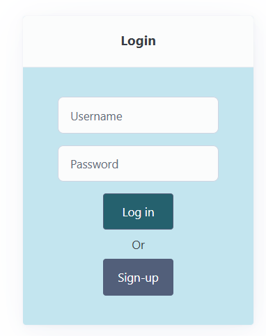 
(This one is how the buttons were styled at originally)

My end users like the second option.

---

## Voting

There is not enough time to make the voting functionality of this app work in time, so I have decided to discard this functionality. This means some of the forms on my website will look different, and the functionality of the website is lessened.

Because there is no voting, option and question fields can be removed from the form.
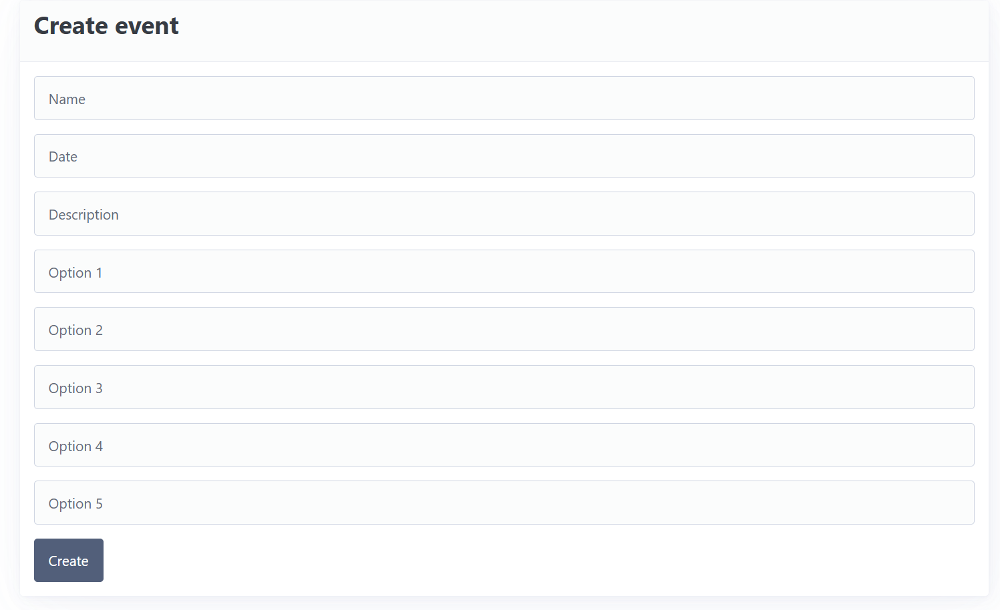
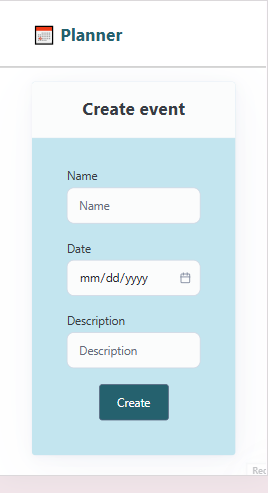

Event details page will only show description, and if there is no description, then there should not be view button.

Math help does not have any details, whereas tutorial does, so there is a view button in the tutorial row.
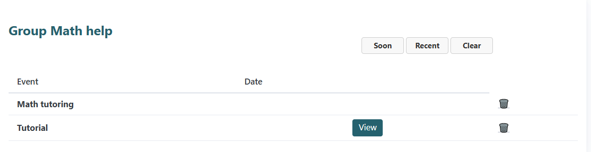
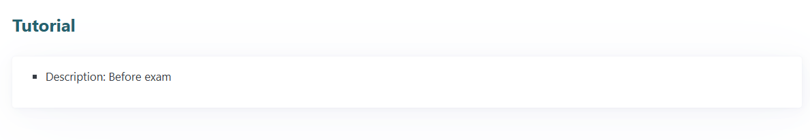

---

## Create event

I was wondering whether it is better for all the member to be able to create events, or only the owner should be able to do it. At the moment, any member can create new event.

I have asked my end user about this, and one of them suggested that only the owner should be able to do it, since the purpose of the website is for an informing purpose. This will keep things neat and simple.

---

## Event page

the line discontinue here for the row input, which inconsistent with the column label.

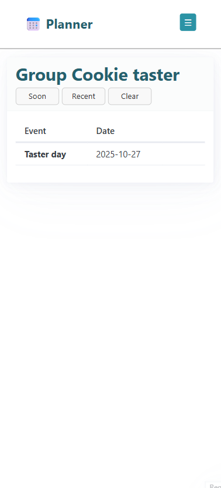

## Website color

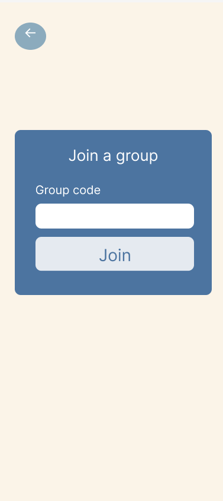
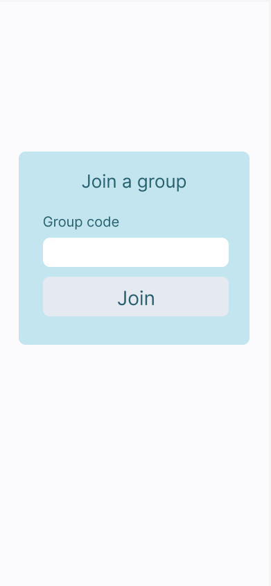

Recall how the join page would look like for each color palette.

Some of the user like the green color palette one, while others like the blue one. One of the users that like the blue one said that both are nice but the fact that she enjoyed the back ground color of the blue one more. It gives more contrast, she said.

So i decided to try change the background color of the green one on my website to light yellow.

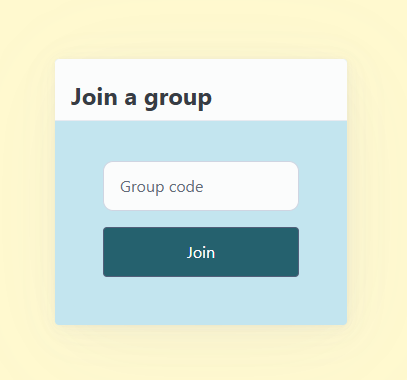

She really likes the yellow, and others agree. However, they said it would be nice if the yellow is a little bit lighter.

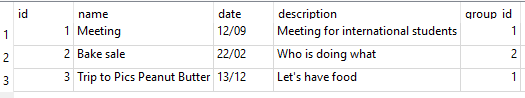

They said this is good! I also need to fix the color of the label and position it to the centre of the form for this to match the design.

---

## Sprint Review
The sprint has made me realized that I would not be able to allow user to vote on my website. One of the main reason is the limited time and with thoughts, there will be more things to consider if this functionality is added. Also, other key features still work as a planner website, I would propose this as a further improvement in the future.

This process has allowed me to get back to my end-user, asking for feedback to improve, especially, the UI of the website. The biggest problem seem to be with the color of the website, where half of the people like one option and another half likes the other option. Because this app is targetting a small group of people, it is possible for me to combine the colour of both options and provided a better solution. However, if more people are using the website, it would be impossible for everyone to like the same color, so I have to constantly remind myself that it is the best for the color to be neutral, or to ensure that at least user will not be uncomfortable using the website eventhough it is not their favourable colour.

